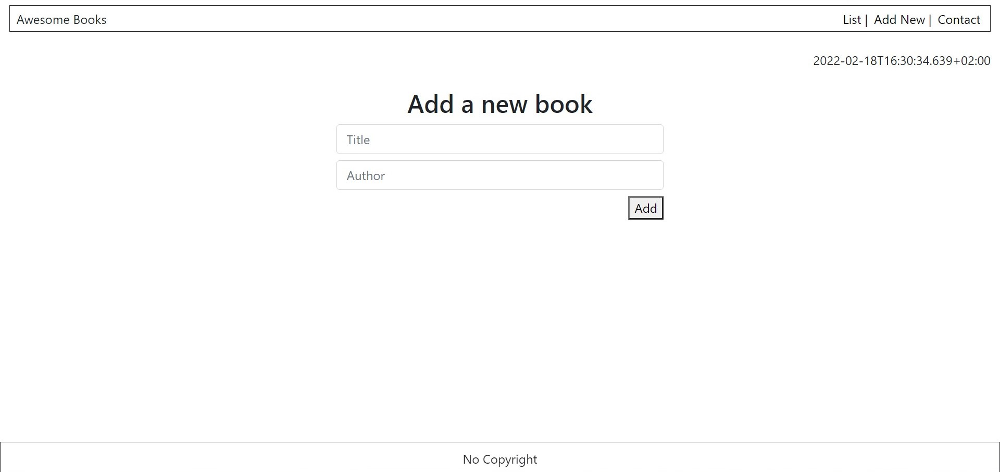

# Awesome Books Practice Project

In this project, we have built a simple website that allows users to add/remove books from a library list of books. Data is stored in `LocalStorage` of the browser.

## Built With

- HTML, CSS and JavaScript
- WebPack

## Live Demo

[Live Demo Link](https://damdafayton.github.io/awesome-books/)

## Getting Started

Download the repo and click `index.html`.

## Authors

👤 **damdafayton**

- [Github](https://github.com/damdafayton)
- [LinkedIn](https://linkedin.com/in/damdafayton)

👤 **Author2**

- Github: [@AyoubMs](https://github.com/AyoubMs)
- LinkedIn: [Ayoub Chahir](https://www.linkedin.com/in/ayoub-chahir/)

## 🤝 Contributing

Contributions, issues, and feature requests are welcome!

Feel free to check the [issues page](../../issues/).

## Show your support

Give a ⭐️ if you like this project!

## Acknowledgments

- Hat tip to all developers.

## 📝 License

This project is [MIT](./MIT.md) licensed.
